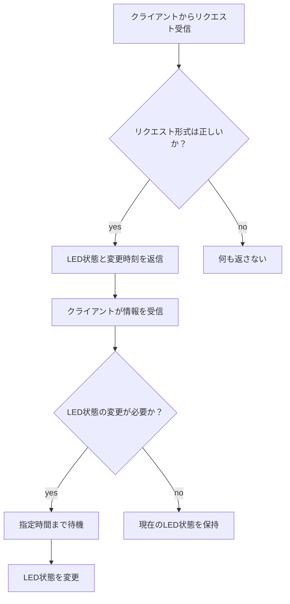

```mermaid
flowchart TD
    A[クライアントからリクエスト受信] --> B{リクエスト形式は正しいか？}
    B -- yes --> C[LED状態と変更時刻を返信]
    B -- no --> Z[何も返さない]
    C --> D[クライアントが情報を受信]
    D --> E{LED状態の変更が必要か？}
    E -- yes --> F[指定時間まで待機]
    F --> G[LED状態を変更]
    E -- no --> I[現在のLED状態を保持]

```
